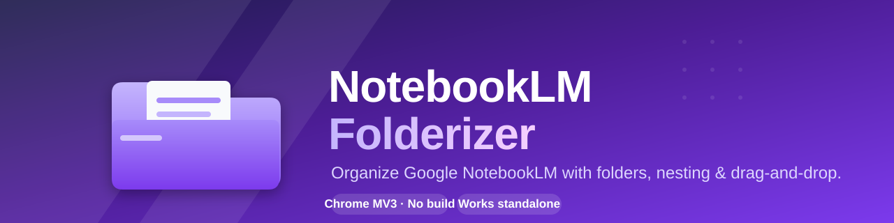
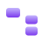
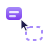
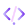
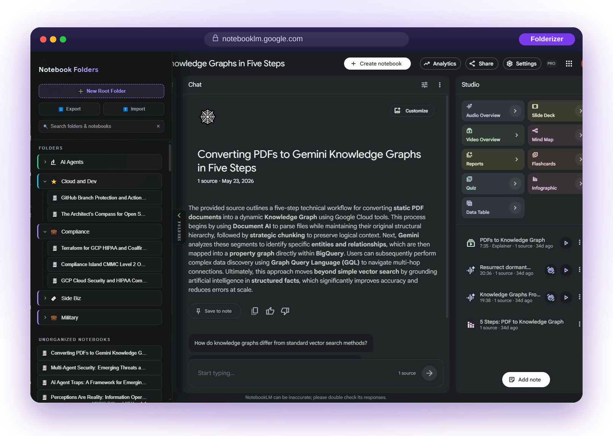
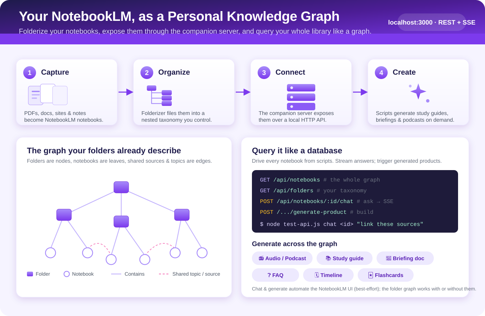
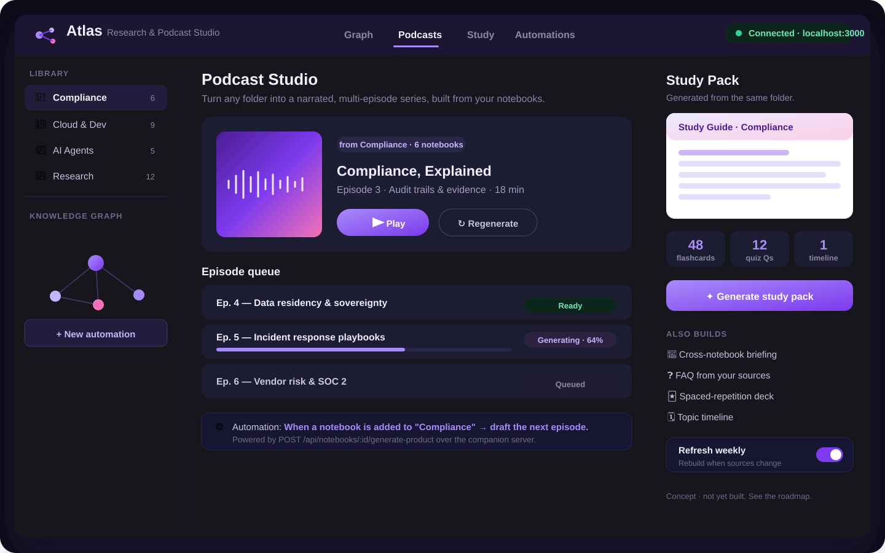

<div align="center">

### ⬇️ Download Atlas Studio (desktop app)

[](https://github.com/mlcyclops/notebooklmchrome/releases/download/v1.0.1/Atlas-Studio-Setup-1.0.1.exe)
[](https://github.com/mlcyclops/notebooklmchrome/releases/download/v1.0.1/Atlas-Studio-1.0.1-arm64.dmg)
[](https://github.com/mlcyclops/notebooklmchrome/releases/download/v1.0.1/Atlas-Studio-1.0.1.AppImage)

<sub><b>v1.0.1</b> · the companion server + Atlas studio in one double-click · macOS is Apple Silicon · builds are unsigned (first launch shows an OS warning). All downloads on the <a href="https://github.com/mlcyclops/notebooklmchrome/releases">Releases page</a>.</sub>

<sub>Just want folders in NotebookLM? <a href="#-install-in-chrome-the-easy-way">Install the browser extension</a> instead (no download, no server).</sub>

</div>

<div align="center">

# NotebookLM Folderizer &amp; Connector

**Bring real folders, nesting, and drag-and-drop to [Google NotebookLM](https://notebooklm.google.com).**
No build step. No account. No server required. Just *Load unpacked* and go.

[](https://developer.chrome.com/docs/extensions/mv3/intro/)
[](#)
[](#license)
[](#contributing)

</div>

---

## ⚡ Get started

Two layers, pick what you need. The **folder organizer** is just the browser extension
(no Node, no server). The **studio + automation** features (knowledge-graph export,
podcast pipeline, study packs, watch mode, and the Atlas app) run on a tiny local
companion server, now also packaged as a one-click **desktop app**.

| You want... | Do this |
| --- | --- |
| 📁 **Folders in NotebookLM** | Load the extension. 30 seconds, no Node. See [Install in Chrome](#-install-in-chrome-the-easy-way). |
| 🧭 **Atlas Studio + automation**<br>(any OS, one double-click) | **Download the desktop app** (companion server + Atlas, bundled), then run it. No Node, npm, or terminal:<br>[⬇ Windows `.exe`](https://github.com/mlcyclops/notebooklmchrome/releases/download/v1.0.1/Atlas-Studio-Setup-1.0.1.exe) · [⬇ macOS `.dmg`](https://github.com/mlcyclops/notebooklmchrome/releases/download/v1.0.1/Atlas-Studio-1.0.1-arm64.dmg) (Apple Silicon) · [⬇ Linux `.AppImage`](https://github.com/mlcyclops/notebooklmchrome/releases/download/v1.0.1/Atlas-Studio-1.0.1.AppImage)<br>On Windows you can instead double-click **`run.bat`** for a guided menu. Want to build it yourself? See the [desktop app section](#-desktop-app-atlas-studio). |
| 💻 **Prefer the terminal** | `npm install && npm start`, then open **http://localhost:3000/atlas**. |

> You still load the browser extension to organize notebooks and to give the studio
> live notebook data. The desktop app / server provides the studio and automation.

## Why?

NotebookLM is fantastic for thinking with your sources, but once you have more than a
handful of notebooks the flat list becomes a maze. **Folderizer** adds the one thing
that has always been missing: a real, nested folder structure you can drag notebooks into,
right inside the NotebookLM UI. Everything lives in your browser and persists across sessions.

For tinkerers, there is also an **optional companion server** that exposes a small
programmatic API (HTTP + Server-Sent Events) by driving the extension. It is handy for scripts,
automations, and experiments, and it lets you treat your whole library as a
[personal knowledge graph](#-use-it-as-a-personal-knowledge-graph).

## ✨ Features

<table>
  <tr>
    <td width="56" align="center"></td>
    <td><b>Custom folders.</b> Group your notebooks however you like, directly in the NotebookLM sidebar.</td>
  </tr>
  <tr>
    <td align="center"></td>
    <td><b>Nested tree.</b> Folders inside folders, as deep as you need, with accordion collapse.</td>
  </tr>
  <tr>
    <td align="center"></td>
    <td><b>Drag &amp; drop.</b> Move notebooks between folders with a simple drag.</td>
  </tr>
  <tr>
    <td align="center"></td>
    <td><b>Persistent.</b> Your structure is saved to <code>chrome.storage.local</code> and survives restarts.</td>
  </tr>
  <tr>
    <td align="center"></td>
    <td><b>Cross-device sync</b> <i>(optional)</i>. Opt in to sync your folders across your signed-in Chrome devices via <code>chrome.storage.sync</code>. No account or server of ours; off by default. Very large folder sets that exceed Chrome's sync quota stay local-only with a clear notice.</td>
  </tr>
  <tr>
    <td align="center"></td>
    <td><b>Zero setup.</b> No build tooling, no bundler, no sign-in. Load unpacked and you are done.</td>
  </tr>
  <tr>
    <td align="center"></td>
    <td><b>Optional programmatic API</b> <i>(advanced)</i>. A local Node server + WebSocket bridge for listing notebooks, streaming chat over SSE, and triggering product generation.</td>
  </tr>
</table>

> The folder organizer is the headline feature and works **completely standalone**.
> The companion server is a separate, optional power-user add-on.

## 📸 What it looks like

<div align="center">



<br /><br />

<sub><b>Nested, collapsible folders</b> with custom colors &amp; icons · <b>drag-and-drop</b> · <b>live search</b> · an <b>Unorganized Notebooks</b> list, all inside the NotebookLM UI.</sub>

</div>

## 🚀 Install in Chrome (the easy way)

No build step. No server. Just load the extension folder:

1. Download or clone this repository.
2. Open Chrome and go to **`chrome://extensions`**.
3. Toggle **Developer mode** on (top-right corner).
4. Click **Load unpacked** and select the **`extension/`** folder from this repo.
5. Open **[notebooklm.google.com](https://notebooklm.google.com)**.
6. Use the **Folderizer sidebar** to create folders and drag your notebooks in. 🎉

That is it. Your folders are stored locally in your browser and persist automatically.

### Other browsers (Edge &amp; Firefox)

Run `npm run package` to build per-browser bundles into `dist/`:

- **Edge** is Chromium-based, so load `dist/edge/` (or `dist/chrome/`) via `edge://extensions` → **Load unpacked**. The `.zip` is ready for the Edge Add-ons store.
- **Firefox** uses a Gecko-adapted manifest in `dist/firefox/`. Load it via `about:debugging` → **This Firefox** → **Load Temporary Add-on**, or submit `dist/firefox.zip` to AMO.

## 🖥️ Desktop app (Atlas Studio)

**Atlas Studio** bundles the companion server and the [Atlas studio UI](#-atlas-a-research--podcast-studio)
into a native desktop app, so you get the studio, knowledge-graph export, and the
podcast / study automation with **one double-click**. No Node, npm, or terminal.

**Get it:**

- **Download an installer** from the [latest release](https://github.com/mlcyclops/notebooklmchrome/releases/latest):
  [Windows `.exe`](https://github.com/mlcyclops/notebooklmchrome/releases/download/v1.0.1/Atlas-Studio-Setup-1.0.1.exe),
  [macOS `.dmg`](https://github.com/mlcyclops/notebooklmchrome/releases/download/v1.0.1/Atlas-Studio-1.0.1-arm64.dmg) (Apple Silicon),
  or [Linux `.AppImage`](https://github.com/mlcyclops/notebooklmchrome/releases/download/v1.0.1/Atlas-Studio-1.0.1.AppImage).
- **Windows, the friendly way:** double-click **`build-desktop.bat`** (or `run.bat` and
  choose option 5) to produce `dist-desktop\Atlas Studio Setup *.exe`.
- **Any platform:** `npm install`, then `npm run dist:win` / `dist:mac` / `dist`. Use
  `npm run desktop` to run the app without packaging.

Installers build on each OS via CI (`.github/workflows/desktop-build.yml`); the macOS
`.dmg` must be built on macOS. Artifacts are unsigned, so the first launch may show an
OS warning (choose "More info" / "Open anyway").

**First launch (connect the extension):** Atlas reads your folders and notebooks through
the browser extension, so load it once. The extension ships **inside the app**: use the
menu **Help → Connect the extension...** to reveal its folder, then in your browser go to
`chrome://extensions` → Developer mode → **Load unpacked** and select that folder. Open
[notebooklm.google.com](https://notebooklm.google.com) and keep the tab open. The status
pill turns green ("Connected") and your library appears. The extension connects on port
**3000**, so close any other companion server first.

> The desktop app delivers the **server + Atlas**. The browser extension still installs
> separately (it has to live in your browser) and supplies the live notebook data and
> generation.

## 🧰 Optional: Companion Server (power users)

> ⚙️ **Advanced / optional.** You do **not** need this for folders. Skip it unless you want
> a programmatic API to drive NotebookLM from scripts.

The companion server is a small Node/Express + WebSocket app. The extension's background
worker connects to it over WebSocket; the server then relays requests to the page via the
content script, and streams responses back out over HTTP.

### Run it

```bash
npm install
npm start          # starts the server on http://localhost:3000
```

On **Windows**, double-click **`run.bat`** for a guided menu: launch Atlas Studio, start
the server and open Atlas, load the extension into Chrome, build the browser packages or
the desktop installer, or run the tests. It auto-detects (or downloads a portable) copy of
Node.js and installs dependencies for you.

Keep at least one NotebookLM tab open so the extension can service requests.

### API

| Method &amp; Path | Description |
| --- | --- |
| `GET /status` | Server health, connected clients, active requests/streams. |
| `GET /api/folders` | Read the saved folder structure (returns `{ "folders": [] }` on first run). |
| `POST /api/folders` | Persist a folder structure. Body: `{ "folders": [...] }`. |
| `GET /api/notebooks` | List the user's notebooks (driven via the extension). |
| `POST /api/notebooks/:id/chat` | Chat with a notebook. Streams the reply as **SSE** (`text/event-stream`). Body: `{ "prompt": "..." }`. |
| `POST /api/notebooks/:id/generate-product` | Trigger a generated product (e.g. `study-guide`, `briefing-doc`, `faq`, `timeline`). Body: `{ "format": "..." }`. |
| `GET /api/graph` | Export the whole library as a knowledge graph. JSON by default; `?format=graphml` returns GraphML (yEd / Gephi / Cytoscape). Built from `folders.json` plus live notebooks when the extension is connected. |
| `GET /api/folders/:id/podcast/plan` | Dry-run: plan a podcast series for a folder (one `audio-overview` episode per notebook). No extension needed. |
| `POST /api/folders/:id/podcast` | Generate the podcast series for a folder. Returns `{ plan, results }`; `?dryRun=1` plans only. |
| `GET /api/folders/:id/study-pack/plan` | Dry-run: plan a study pack (study-guide / briefing-doc / faq / timeline; `?formats=` to choose). |
| `POST /api/folders/:id/study-pack` | Generate the study pack for a folder. Returns `{ plan, results }`; `?dryRun=1` plans only. |
| `POST /api/watch` · `POST /api/watch/stop` · `GET /api/watch` | Watch mode: poll for folder changes on an interval (`{ intervalMs, autoGenerate }`); detect-only by default. |
| `GET /api/watch/plan` | Dry-run: what watch would (re)generate given current state vs the baseline. |

A small CLI helper, **`test-api.js`**, exercises these endpoints:

```bash
node test-api.js status
node test-api.js folders
node test-api.js notebooks
node test-api.js chat <notebook_id> "Summarize the key points"
node test-api.js generate <notebook_id> study-guide
node test-api.js graph                 # knowledge graph as JSON
node test-api.js graph graphml         # knowledge graph as GraphML
node test-api.js podcast <folder_id>   # plan a podcast series for a folder
node test-api.js studypack <folder_id> # plan a study pack for a folder
node test-api.js watch                 # watch-mode status + pending regen plan
```

> ⚠️ **Experimental.** The chat and product-generation endpoints automate NotebookLM's web
> UI on a best-effort basis. Google's interface changes over time, so treat these as
> experimental and expect occasional breakage. The folder organizer is unaffected by this.

A starter folder layout is provided in **`folders.example.json`**. Copy it to `folders.json`
if you want the server to seed an initial structure (the live `folders.json` is git-ignored).

### 🕸️ Use it as a personal knowledge graph

Your folders already describe a graph: folders are nodes, notebooks are leaves, and shared
sources or topics are the edges between them. With the companion server you can read that
structure programmatically (`/api/folders`, `/api/notebooks`), query any notebook
(`/chat`), and generate material across the whole library (`/generate-product`). That turns
NotebookLM into a queryable, automatable knowledge base for study packs, briefings, and
podcasts.

<div align="center">



</div>

## 🏗️ Architecture

```
                          Standalone (default)
   ┌───────────────────────────┐        ┌──────────────────────┐
   │  Folderizer sidebar (UI)  │ <────> │  chrome.storage.local │
   │  content.js / content.css │        │  (persistent folders) │
   └───────────────────────────┘        └──────────────────────┘

                       Optional companion server
   ┌──────────────┐   HTTP/SSE   ┌────────────┐   WebSocket   ┌───────────────┐   DOM   ┌──────────────┐
   │  your script │ <──────────> │ server.js  │ <───────────> │ background.js │ <─────> │  content.js  │
   │  / test-api  │   :3000      │ (Express)  │               │ (MV3 worker)  │         │  NotebookLM  │
   └──────────────┘              └────────────┘               └───────────────┘         └──────────────┘
```

- **Extension (`extension/`)**: `manifest.json` (MV3), plus `content.js`/`content.css` that render the
  folder sidebar on NotebookLM and persist to `chrome.storage.local`. `background.js` is the
  service worker that bridges to the optional server.
- **Server (`server.js`)**: Express REST + an attached WebSocket server. It never talks to
  Google directly; it relays requests to the extension and streams results back. It also
  serves the Atlas studio at `/atlas` and exposes `start(port)` so it can be embedded.
- **Desktop (`desktop/`)**: an Electron shell that boots `server.js` in-process and opens
  Atlas in a native window. Packaged into Windows / macOS / Linux installers with
  electron-builder (`npm run dist`).

## 🛠️ Development

```bash
git clone <this-repo>
cd notebooklmchrome

# Extension: load unpacked from extension/ (see install steps above).
# After editing extension files, hit "Reload" on chrome://extensions.

# Server (optional):
npm install
node --check server.js   # quick syntax check
npm start
```

- Extension code lives in `extension/` (no bundler; edit and reload).
- Server code is `server.js`; the API smoke-test client is `test-api.js`.
- Brand assets and figures live in `assets/`. Regenerate the framed hero image with
  `node tools/build-hero.js` after replacing `assets/folders-screenshot.png`.
- `npm run check` syntax-checks the JS; `npm test` runs the unit + integration
  harnesses (9 suites); `npm run package` builds the Chrome / Edge / Firefox bundles into `dist/`.
- `npm run desktop` runs the Electron app; `npm run dist:win` / `dist:mac` / `dist` build
  the desktop installers into `dist-desktop/` (`node tools/build-icon.js` regenerates the app icon).
- Pure libraries live in `lib/` (`knowledge-graph.js`, `automation-pipeline.js`); the Atlas
  UI is in `atlas/` (build-free, with a shared view-model in `atlas/atlas-view.js`).
- Decisions are recorded in [`docs/adr/`](docs/adr/README.md); product and go-to-market
  thinking is in [`docs/business-strategy.md`](docs/business-strategy.md).

## 🗺️ Roadmap

**Shipped**

- [x] Folder colors &amp; icons
- [x] Import / export folder structures (JSON)
- [x] Search and filter within folders
- [x] Sync folders across devices
- [x] Premium UI/UX redesign with trustworthy loading / empty / error states
- [x] Harden the experimental chat / generate automation against UI changes
- [x] Export the knowledge graph (folders + notebooks + cross-links) as JSON / GraphML
- [x] Firefox / Edge packaging
- [x] Automated **podcast pipeline**: turn a folder into a narrated, multi-episode series via `generate-product`
- [x] **Research / study packs**: cross-notebook study guides, briefings, faq, and timelines for a folder
- [x] **Watch mode**: detect folder changes and (optionally) regenerate products automatically
- [x] 🧭 **Atlas**: a Research &amp; Podcast Studio app on top of the server (see below)
- [x] One-click **desktop app** (Atlas Studio) with Windows / macOS / Linux installer pipelines
- [x] Guided **`.bat` launchers** with menus and ASCII art

**Next (future ideas)**

- [ ] Full Graph + Study tabs in Atlas (interactive graph, audio playback, scheduling UI)
- [ ] Persisted job queue / scheduler for watch mode (survives restart)
- [ ] Push-based change detection from the extension (replace polling)
- [ ] Knowledge-graph cross-links from shared sources (beyond shared topics/tags)

## 🧭 Atlas: a Research &amp; Podcast Studio

**Atlas** is a Research &amp; Podcast Studio that ships with the companion server. It treats
your folderized notebooks as a knowledge graph and turns them into finished material:
pick a folder and Atlas plans a narrated, multi-episode **podcast series**, plus a matching
**study pack** (study guide, briefing, faq, timeline). **Watch mode** keeps it fresh: when a
notebook lands in a folder, Atlas can regenerate automatically.

It is entirely powered by the API above. No new access to Google is required; Atlas only talks
to `localhost:3000`.

**Launch it:** easiest is the **[desktop app](#-desktop-app-atlas-studio)** (one double-click).
Or start the companion server (`npm start`, or `run.bat`) and open
**[http://localhost:3000/atlas](http://localhost:3000/atlas)**. Keep a NotebookLM tab open so
generation can run (planning works without it).

<div align="center">



<br />

<sub>The design concept above; the shipping app lives at <code>/atlas</code> and is wired to the live API.</sub>

</div>

## 🤝 Contributing

Contributions are very welcome! Please:

1. Fork the repo and create a feature branch.
2. Keep changes focused; match the existing code style.
3. Run `node --check server.js` and manually load the extension to sanity-check.
4. Open a PR describing **what** changed and **why**.

Bug reports and feature ideas via issues are appreciated too.

## License

Released under the **MIT License**. See below.

```
MIT License

Copyright (c) 2026 NotebookLM Folderizer contributors

Permission is hereby granted, free of charge, to any person obtaining a copy
of this software and associated documentation files (the "Software"), to deal
in the Software without restriction, including without limitation the rights
to use, copy, modify, merge, publish, distribute, sublicense, and/or sell
copies of the Software, and to permit persons to whom the Software is
furnished to do so, subject to the following conditions:

The above copyright notice and this permission notice shall be included in all
copies or substantial portions of the Software.

THE SOFTWARE IS PROVIDED "AS IS", WITHOUT WARRANTY OF ANY KIND, EXPRESS OR
IMPLIED, INCLUDING BUT NOT LIMITED TO THE WARRANTIES OF MERCHANTABILITY,
FITNESS FOR A PARTICULAR PURPOSE AND NONINFRINGEMENT. IN NO EVENT SHALL THE
AUTHORS OR COPYRIGHT HOLDERS BE LIABLE FOR ANY CLAIM, DAMAGES OR OTHER
LIABILITY, WHETHER IN AN ACTION OF CONTRACT, TORT OR OTHERWISE, ARISING FROM,
OUT OF OR IN CONNECTION WITH THE SOFTWARE OR THE USE OR OTHER DEALINGS IN THE
SOFTWARE.
```

---

<div align="center">

<sub>Built with 💜 for NotebookLM power users · Discussion: <a href="https://covertconsortium.slack.com/archives/C0ACZGS993R/p1782512566403909">Slack thread</a></sub>

</div>
