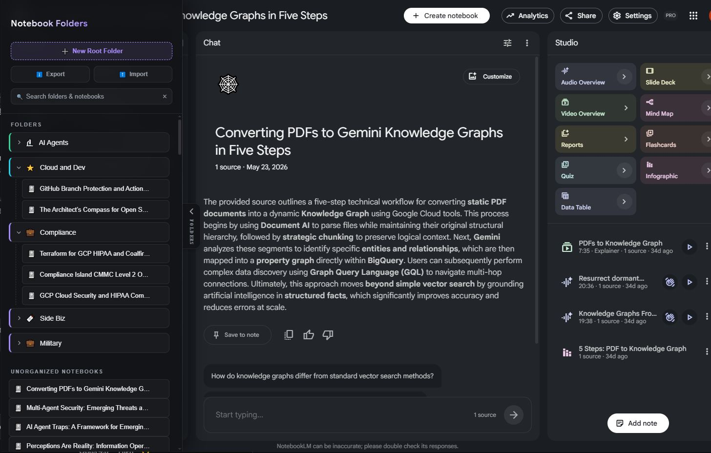

<div align="center">

# NotebookLM Folderizer &amp; Connector

**Bring real folders, nesting, and drag-and-drop to [Google NotebookLM](https://notebooklm.google.com).**
No build step. No account. No server required — just *Load unpacked* and go.

[](https://developer.chrome.com/docs/extensions/mv3/intro/)
[](#)
[](#license)
[](#contributing)

</div>

---

## Why?

NotebookLM is fantastic for thinking with your sources — but once you have more than a
handful of notebooks, the flat list becomes a maze. **Folderizer** adds the one thing
that has always been missing: a real, nested folder structure you can drag notebooks into,
right inside the NotebookLM UI. Everything lives in your browser and persists across sessions.

For tinkerers, there's also an **optional companion server** that exposes a small
programmatic API (HTTP + Server-Sent Events) by driving the extension — handy for scripts,
automations, and experiments.

## ✨ Features

- 📁 **Custom folders** — group your notebooks however you like, directly in the NotebookLM sidebar.
- 🌳 **Nested tree** — folders inside folders, as deep as you need.
- 🖱️ **Drag &amp; drop** — move notebooks between folders with a simple drag.
- 💾 **Persistent** — your structure is saved to `chrome.storage.local` and survives restarts.
- ⚡ **Zero setup** — no build tooling, no bundler, no sign-in. Load unpacked and you're done.
- 🔌 **Optional programmatic API** *(advanced)* — a local Node server + WebSocket bridge for
  listing notebooks, streaming chat over SSE, and triggering product generation.

> The folder organizer is the headline feature and works **completely standalone**.
> The companion server is a separate, optional power-user add-on.

## 📸 What it looks like

<div align="center">

<a href="assets/folders-screenshot.png">
  
</a>

<br /><br />

<sub><b>Nested, collapsible folders</b> with custom colors &amp; icons · <b>drag-and-drop</b> · <b>live search</b> · an <b>Unorganized Notebooks</b> list — all inside the NotebookLM UI.</sub>

</div>

## 🚀 Install in Chrome (the easy way)

No build step. No server. Just load the extension folder:

1. Download or clone this repository.
2. Open Chrome and go to **`chrome://extensions`**.
3. Toggle **Developer mode** on (top-right corner).
4. Click **Load unpacked** and select the **`extension/`** folder from this repo.
5. Open **[notebooklm.google.com](https://notebooklm.google.com)**.
6. Use the **Folderizer sidebar** to create folders and drag your notebooks in. 🎉

That's it — your folders are stored locally in your browser and persist automatically.

## 🧰 Optional: Companion Server (power users)

> ⚙️ **Advanced / optional.** You do **not** need this for folders. Skip it unless you want
> a programmatic API to drive NotebookLM from scripts.

The companion server is a small Node/Express + WebSocket app. The extension's background
worker connects to it over WebSocket; the server then relays requests to the page via the
content script, and streams responses back out over HTTP.

### Run it

```bash
npm install
npm start          # starts the server on http://localhost:3000
```

On **Windows**, you can instead double-click **`run.bat`**, which will detect (or download a
portable) Node.js, install dependencies, start the server, and launch Chrome with the
extension pre-loaded.

Keep at least one NotebookLM tab open so the extension can service requests.

### API

| Method &amp; Path | Description |
| --- | --- |
| `GET /status` | Server health, connected clients, active requests/streams. |
| `GET /api/folders` | Read the saved folder structure (returns `{ "folders": [] }` on first run). |
| `POST /api/folders` | Persist a folder structure. Body: `{ "folders": [...] }`. |
| `GET /api/notebooks` | List the user's notebooks (driven via the extension). |
| `POST /api/notebooks/:id/chat` | Chat with a notebook. Streams the reply as **SSE** (`text/event-stream`). Body: `{ "prompt": "..." }`. |
| `POST /api/notebooks/:id/generate-product` | Trigger a generated product (e.g. `study-guide`, `briefing-doc`, `faq`, `timeline`). Body: `{ "format": "..." }`. |

A small CLI helper, **`test-api.js`**, exercises these endpoints:

```bash
node test-api.js status
node test-api.js folders
node test-api.js notebooks
node test-api.js chat <notebook_id> "Summarize the key points"
node test-api.js generate <notebook_id> study-guide
```

> ⚠️ **Experimental.** The chat and product-generation endpoints automate NotebookLM's web
> UI on a best-effort basis. Google's interface changes over time, so treat these as
> experimental and expect occasional breakage. The folder organizer is unaffected by this.

A starter folder layout is provided in **`folders.example.json`** — copy it to `folders.json`
if you want the server to seed an initial structure (the live `folders.json` is git-ignored).

## 🏗️ Architecture

```
                          Standalone (default)
   ┌───────────────────────────┐        ┌──────────────────────┐
   │  Folderizer sidebar (UI)  │ <────> │  chrome.storage.local │
   │  content.js / content.css │        │  (persistent folders) │
   └───────────────────────────┘        └──────────────────────┘

                       Optional companion server
   ┌──────────────┐   HTTP/SSE   ┌────────────┐   WebSocket   ┌───────────────┐   DOM   ┌──────────────┐
   │  your script │ <──────────> │ server.js  │ <───────────> │ background.js │ <─────> │  content.js  │
   │  / test-api  │   :3000      │ (Express)  │               │ (MV3 worker)  │         │  NotebookLM  │
   └──────────────┘              └────────────┘               └───────────────┘         └──────────────┘
```

- **Extension (`extension/`)** — `manifest.json` (MV3), `content.js`/`content.css` render the
  folder sidebar on NotebookLM and persist to `chrome.storage.local`. `background.js` is the
  service worker that bridges to the optional server.
- **Server (`server.js`)** — Express REST + an attached WebSocket server. It never talks to
  Google directly; it relays requests to the extension and streams results back.

## 🛠️ Development

```bash
git clone <this-repo>
cd notebooklmchrome

# Extension: load unpacked from extension/ (see install steps above).
# After editing extension files, hit "Reload" on chrome://extensions.

# Server (optional):
npm install
node --check server.js   # quick syntax check
npm start
```

- Extension code lives in `extension/` (no bundler — edit and reload).
- Server code is `server.js`; the API smoke-test client is `test-api.js`.

## 🗺️ Roadmap

- [ ] Folder colors &amp; icons
- [ ] Import / export folder structures (JSON)
- [ ] Search and filter within folders
- [ ] Sync folders across devices
- [ ] Harden the experimental chat / generate automation against UI changes
- [ ] Firefox / Edge packaging

## 🤝 Contributing

Contributions are very welcome! Please:

1. Fork the repo and create a feature branch.
2. Keep changes focused; match the existing code style.
3. Run `node --check server.js` and manually load the extension to sanity-check.
4. Open a PR describing **what** changed and **why**.

Bug reports and feature ideas via issues are appreciated too.

## License

Released under the **MIT License**. See below.

```
MIT License

Copyright (c) 2026 NotebookLM Folderizer contributors

Permission is hereby granted, free of charge, to any person obtaining a copy
of this software and associated documentation files (the "Software"), to deal
in the Software without restriction, including without limitation the rights
to use, copy, modify, merge, publish, distribute, sublicense, and/or sell
copies of the Software, and to permit persons to whom the Software is
furnished to do so, subject to the following conditions:

The above copyright notice and this permission notice shall be included in all
copies or substantial portions of the Software.

THE SOFTWARE IS PROVIDED "AS IS", WITHOUT WARRANTY OF ANY KIND, EXPRESS OR
IMPLIED, INCLUDING BUT NOT LIMITED TO THE WARRANTIES OF MERCHANTABILITY,
FITNESS FOR A PARTICULAR PURPOSE AND NONINFRINGEMENT. IN NO EVENT SHALL THE
AUTHORS OR COPYRIGHT HOLDERS BE LIABLE FOR ANY CLAIM, DAMAGES OR OTHER
LIABILITY, WHETHER IN AN ACTION OF CONTRACT, TORT OR OTHERWISE, ARISING FROM,
OUT OF OR IN CONNECTION WITH THE SOFTWARE OR THE USE OR OTHER DEALINGS IN THE
SOFTWARE.
```

---

<div align="center">

<sub>Built with 💜 for NotebookLM power users · Discussion: <a href="https://covertconsortium.slack.com/archives/C0ACZGS993R/p1782512566403909">Slack thread</a></sub>

</div>
